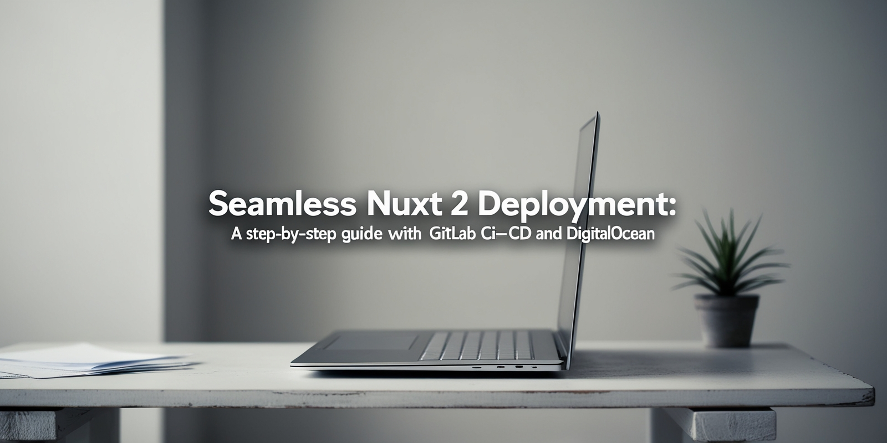

# Seamless Nuxt 2 Deployment

### Step-by-Step Guide with GitLab CI/CD and DigitalOcean

**Article:** [Read on DEV](https://dev.to/tegos/seamless-nuxt-2-deployment-a-step-by-step-guide-with-gitlab-cicd-and-digitalocean-441d)  
**Repository:** [View source](https://gitlab.com/tegos/demo-deploy-nuxt2-app)

---

## Overview

Deploy your **Nuxt 2** application with **GitLab CI/CD** and **DigitalOcean** - automated builds, zero-downtime deployments, and secure HTTPS.

---

## Steps

1. **Server Setup**: Create a DigitalOcean Droplet, lock it down with SSH & firewall, install Node 18.x, PM2 and Nginx.
2. **CI/CD Pipeline**: Configure `.gitlab-ci.yml` to test, build and deploy your app via SSH on main branch.
3. **Deployment Workflow**: Use `ecosystem.config.js` + PM2 for cluster mode, graceful reloads and release versioning.
4. **HTTPS Setup**: Use Let's Encrypt + Certbot to enable SSL on your domain.

---

## Results

- Automatic deployment on pushes to `main`
- Zero downtime with PM2 hot-reload
- Live app accessible via domain
- Clean, repeatable deployment pipeline

---

**Read the full guide:** [Seamless Nuxt 2 Deployment](https://dev.to/tegos/seamless-nuxt-2-deployment-a-step-by-step-guide-with-gitlab-cicd-and-digitalocean-441d)  
**Explore the code:** [GitLab Repository](https://gitlab.com/tegos/demo-deploy-nuxt2-app)